# Dokumentace aplikace: Annonce.cz job scraper

Tento dokument popisuje architekturu, datové toky, konfiguraci a výstupní formát scraperu pracovních inzerátů z Annonce.cz. Slouží jako vzor pro podobnou aplikaci na jiném inzertním serveru.

---

## 1. Úvod a účel

**Co aplikace dělá**

- Projde stránkovaný **výpis** inzerátů (kategorie práce na Annonce.cz).
- **Deduplikuje** odkazy na detail.
- U každé unikátní firmy z výpisu rozhodne, zda jde o **personální agenturu** nebo přímého zaměstnavatele (heuristika + LLM). Inzeráty označené jako agentura se **nestahují** na detail.
- U zbývajících inzerátů **stáhne detail stránku**, z HTML extrahuje strukturovaná data pomocí **LLM** (crawl4ai + Gemini).
- Výsledky **validuje** (Pydantic), přiřadí štítek **blue collar** vs. **Vyřazeno** (další volání Gemini).
- Zapíše výsledek do **CSV** souboru.

**Hlavní technologie**

| Oblast | Knihovna / služba |
|--------|-------------------|
| Orchestrace kroků | LangGraph (`StateGraph`) |
| Prohlížečové stahování + LLM extrakce z HTML | crawl4ai (`AsyncWebCrawler`, `LLMExtractionStrategy`) |
| Klasifikace firem a blue-collar | Google Generative AI (`google-generativeai`) |
| Modely dat | Pydantic |
| Volitelné trasování běhu | LangSmith (`langsmith_setup.py`) |

**Vstupní bod:** `main.py` — načte `.env` (pokud je `python-dotenv`), sestaví graf (`graph_builder.build_graph`), spustí `ainvoke` s prázdným stavem a na konci vytiskne souhrn (počty listingů, detailů, cesta k CSV, varování).

---

## 2. Spuštění

```bash
# Z kořene projektu (doporučené virtuální prostředí s nainstalovanými závislostmi z requirements.txt)
python main.py
```

Při prvním spuštění bez předaného `max_pages` ve stavu se **počet stránek výpisu** může dotázat z konzole (viz `nodes/console_prompts.py`); výchozí hodnota jde nastavit přes `MAX_PAGES` v prostředí.

---

## 3. Proměnné prostředí a stav

Většina parametrů se načítá v uzlu `nodes/input_node.py` z prostředí nebo z předaného `ScraperState` (programové volání grafu).

### 3.1 Přehled proměnných prostředí

| Proměnná | Význam (zkráceně) | Výchozí v kódu |
|----------|-------------------|----------------|
| `MAX_PAGES` | Max. počet stránek výpisu (když není `max_pages` ve stavu) | `2` |
| `CONCURRENCY` | Paralelita u detailního crawlu (semaphore) | `4` |
| `LISTING_BASE_URL` | Šablona URL výpisu; podporuje `{page}` nebo `?page=` | viz `state.DEFAULT_ANNONCE_LISTING_URL` |
| `OUTPUT_CSV_PATH` | Cílový CSV soubor | `annonce_export.csv` |
| `REQUEST_DELAY_SEC` | Základní delay (legacy název; část toku používá min/max delaye níže) | `0.8` |
| `MIN_PAGE_DELAY_SEC` / `MAX_PAGE_DELAY_SEC` | Náhodná pauza mezi stránkami výpisu | `2.0` / `5.0` |
| `MIN_DETAIL_DELAY_SEC` / `MAX_DETAIL_DELAY_SEC` | Náhodná pauza u detailů | `2.0` / `6.0` |
| `DETAIL_BATCH_SIZE` | Velikost „dávky“ před delší pauzou v detailním crawlu | `2` |
| `GEMINI_API_KEY` | API klíč pro Gemini (extrakce + klasifikace) | *povinné pro plnou funkci* |
| `GEMINI_MODEL` | Model pro extrakci z detailu a klasifikaci agentur | `gemini-1.5-flash` |
| `NAVIGATION_WAIT_PROFILES` | Čárkou oddělené `wait_until` režimy pro Playwright | `networkidle,domcontentloaded,load` |
| `LISTING_NAVIGATION_RETRIES` / `DETAIL_NAVIGATION_RETRIES` | Retry na profil navigace | `1` |
| `LISTING_PAGE_TIMEOUT_MS` / `DETAIL_PAGE_TIMEOUT_MS` | Timeout načtení stránky | `60000` / `70000` |
| `NAVIGATION_TIMEOUT_STEP_MS` | Krok navyšování timeoutu při opakování | `10000` |
| `MAX_CONSECUTIVE_EMPTY_PAGES` | Po tolika prázdných stránkách za sebou se výpis ukončí | `3` |
| `ANTI_BLOCK_SIGNATURES` | Vlastní čárkou oddělené podřetězce pro detekci blokace (lowercase) | výchozí české fráze v `extractors.py` |

**Blue-collar uzel** (`nodes/blue_collar_classification_node.py`) volá model **`gemini-2.5-flash` natvrdo** — nejde o `GEMINI_MODEL` z env.

### 3.2 LangSmith (volitelné)

Popis v `langsmith_setup.py`:

- `LANGCHAIN_TRACING_V2=true` — zapne trasování
- `LANGCHAIN_API_KEY` nebo `LANGSMITH_API_KEY`
- `LANGCHAIN_PROJECT` — název projektu v UI
- `LANGCHAIN_ENDPOINT` — např. EU instance

Metadata běhu grafu: tagy `annonce`, `langgraph`; `run_name` výchozí `annonce-scraper`.

### 3.3 Struktura stavu `ScraperState`

Definice: `state.py` (`TypedDict`, většina klíčů volitelných).

Mezi důležité klíče patří:

- **Konfigurace běhu:** `listing_base_url`, `max_pages`, `concurrency`, různé `*_delay_sec`, `detail_batch_size`, `gemini_model`, `navigation_wait_profiles`, retry a timeout hodnoty, `max_consecutive_empty_pages`
- **Data:** `listing_items`, `company_classification`, `raw_details`, `valid_details`
- **Diagnostika:** `errors`, `warnings`
- **Výstup:** `output_csv_path`

Programové spuštění: předat části stavu už při `ainvoke` (např. `max_pages`, `listing_base_url`) — přepíše výchozí z env.

---

## 4. Architektura pipeline (LangGraph)

```mermaid
flowchart LR
  input[input_node]
  discover[discover_anonce_node]
  dedupe[dedupe_listings_node]
  agency[agency_classification_node]
  deep[deep_crawl_details_node]
  validate[validate_and_normalize_node]
  blue[blue_collar_classification_node]
  export[export_csv_node]
  input --> discover --> dedupe --> agency --> deep --> validate --> blue --> export
```



Sestavení grafu: `graph_builder.py` — lineární řetězec uzlů, poslední hrana na `END`.

| Pořadí | Uzel | Soubor | Úloha |
|--------|------|--------|--------|
| 1 | `input_node` | `nodes/input_node.py` | Sloučí env + volitelný vstupní state, inicializuje seznamy |
| 2 | `discover_anonce_node` | `nodes/discover_anonce_node.py` | Stáhne a parsuje výpis → `listing_items`, přidá `warnings` |
| 3 | `dedupe_listings_node` | `nodes/dedupe_node.py` | Dedup podle `detail_url` |
| 4 | `agency_classification_node` | `nodes/agency_classification_node.py` | `company_classification`: `agency` / `direct_employer` / `uncertain` |
| 5 | `deep_crawl_details_node` | `nodes/deep_crawl_details_node.py` | Crawl detailů jen pro firmy ≠ `agency` → `raw_details` |
| 6 | `validate_and_normalize_node` | `nodes/validate_node.py` | Dict → `JobDetail` → `valid_details` |
| 7 | `blue_collar_classification_node` | `nodes/blue_collar_classification_node.py` | Doplní `blue_collar_label` na každém záznamu |
| 8 | `export_csv_node` | `nodes/export_csv_node.py` | Zapíše CSV, aktualizuje `output_csv_path` |

---

## 5. Datové modely a tok dat

### 5.1 `ListingItem` (`utils.py`)

Používá se pro položky z **výpisu**.

| Pole | Typ / poznámka |
|------|----------------|
| `source_site` | Literál `"anonce"` |
| `title` | Nadpis z HTML výpisu |
| `company` | Z výpisu často prázdné (parser `annonce_listing.py` firmu z karty nedoplňuje) |
| `detail_url` | Absolutní URL detailu inzerátu |
| `ad_date` | Datum z karty (`div.ad-date`), pokud ho parser najde |

### 5.2 `JobDetail` (`utils.py`)

Výsledek po extrakci z detailu + validaci + klasifikace.

| Pole | Poznámka |
|------|----------|
| `source_site` | `"anonce"` |
| `listing_url` | Základní URL výpisu (šablona/kategorie) |
| `detail_url` | Odkaz na inzerát |
| `ad_date` | Z propagace z `ListingItem` |
| `city`, `company`, `position`, `short_description` | Z LLM extrakce / fallback |
| `keywords` | Seznam řetězců |
| `email`, `phone` | Kontakty z extrakce |
| `agency_status` | Stav z klasifikace firmy u tohoto inzerátu |
| `blue_collar_label` | `Blue collars` nebo `Vyřazeno` |

### 5.3 Tok mezi uzly (zjednodušeně)

1. **Výpis:** HTML stránek → parsování → `ListingItem[]`
2. **Dedup:** stejný `detail_url` jen jednou
3. **Agentury:** pro každou unikátní neprázdnou `company` → rozhodnutí; u prázdné firmy klasifikace v tomto uzlu nenastane (detail pak může použít `uncertain` z `.get(company, "uncertain")`)
4. **Detaily:** filtrování `listing_items` kde `company_classification[company] != "agency"`
5. **Raw:** seznam slovníků z crawl4ai + doplněná metadata
6. **Validní:** Pydantic `JobDetail` (nevalidní řádky → varování, vynechány z `valid_details`)
7. **Export:** jen `valid_details` → CSV

---

## 6. Stahování a extrakce (technický přehled)

### 6.1 Výpis (`extractors.discover_anonce_listings`)

- Sestavení URL stránky: pokud `listing_base_url` obsahuje `{page}`, použije se `format(page=…)`; jinak stránkování přes `?page=` nebo `&page=`.
- **Primárně HTTP** GET (`urllib`) s hlavičkami z `humanize.browser_headers`, podpora gzip/deflate, `Referer` z předchozí stránky.
- Prázdné tělo → fallback **Playwright** přes crawl4ai s postupným zkoušením `wait_until` profilů a prodlužováním timeoutu.
- HTML → `annonce_listing.parse_anonce_listing_html` (regexy na `h2 > a.clickable`, fallback na obecnější odkazy `/inzerat/...`).
- **Anti-bot:** `_check_for_anti_block` — při shodě signatury vyvolá `AntiBlockDetected` a smyčka výpisu se přeruší.
- Mezi stránkami náhodná pauza `humanize.human_delay(min_page_delay_sec, max_page_delay_sec)`.

### 6.2 Detail (`extractors.extract_job_detail` + `deep_crawl_details`)

- Jeden sdílený `AsyncWebCrawler`, semaphore podle `concurrency`.
- `LLMExtractionStrategy` s JSON schema (povinné pole `position`; ostatní skaláry volitelné, `keywords` pole).
- Před/po načtení: JS souhlas s cookies (`COOKIE_JS`), scroll (`HUMAN_SCROLL_JS`), `reading_pause`.
- Výstup LLM se parsuje z `result.extracted_content`, sloučí s `listing_url`, `detail_url`, `ad_date`, `agency_status`, doplnění `position` z `listing.title` pokud chybí.
- `deep_crawl_details` zpracovává inzeráty v dávkách (`detail_batch_size`), mezi dávkami pauzy; po náhodném počtu zpracovaných inzerátů delší pauza (omezení zátěže).
- Při `AntiBlockDetected` na detailu se ukončí zpracování zbývajících inzerátů.

### 6.3 Klasifikace firem (`utils.classify_company`)

- Pokud normalizovaný název obsahuje některý z `KNOWN_AGENCIES` → okamžitě `agency`.
- Jinak synchronní volání Gemini s požadavkem na JSON: `status`, `reason`.

### 6.4 Blue collar (`utils.classify_blue_collar_job`)

- Prompt v angličtině, odpověď musí být přesně `Blue collars` nebo `Vyřazeno`.
- Voláno asynchronně přes `asyncio.to_thread` z uzlu s limitem paralelity `concurrency`.

---

## 7. Formát výstupu (CSV)

- **Kódování:** UTF-8 s BOM (`utf-8-sig`) — Excel na Windows lépe rozpozná češtinu.
- **Oddělovač:** standardní CSV (`csv.DictWriter`).
- **Cesta:** hodnota `output_csv_path` ve stavu po `input_node` (z env `OUTPUT_CSV_PATH` nebo předáno zvenku).

### Sloupce (hlavička souboru)

| Sloupec v CSV | Odpovídající pole `JobDetail` |
|---------------|-------------------------------|
| `Datum přidání` | `ad_date` |
| `Pozice` | `position` |
| `Kategorie` | `blue_collar_label` (`Blue collars` / `Vyřazeno`) |
| `Popis` | `short_description` |
| `Město` | `city` |
| `Klíčová slova` | `keywords` spojené čárkou a mezerou |
| `Telefon` | `phone` |
| `Odkaz` | `detail_url` |

**Pole, která se do CSV nezapisují**, ale existují v modelu: `email`, `company`, `agency_status`, `listing_url`, `source_site` (případně rozšířit `export_details_to_csv` ve `utils.py`, pokud je potřeba).

---

## 8. Závislosti

Soubor `requirements.txt`:

- `crawl4ai` — crawler + LLM extrakce
- `google-generativeai` — přímé volání Gemini v `utils.py`
- `langgraph` — graf
- `langsmith` — trasování
- `pydantic` — modely
- `python-dotenv` — načtení `.env` v `main.py`

---

## 9. Checklist: podobná aplikace pro jiný server

1. **URL a stránkování:** Upravit šablonu výpisu a logiku `_build_listing_url` v `extractors.py` (nebo nový modul), aby odpovídala cílovému webu.
2. **Parser výpisu:** Nová funkce typu `parse_*_listing_html` (jako `annonce_listing.py`) — selektory/regexy podle HTML cíle; naplnit minimálně `detail_url`, ideálně i `title`, `ad_date`, případně `company`.
3. **Pydantic:** Změnit literál `source_site` z `"anonce"` na identifikátor nového zdroje (`ListingItem`, `JobDetail`).
4. **LLM extrakce detailu:** Upravit `_detail_extraction_strategy` — `instruction` a `schema` podle jazyka a polí, která potřebuješ (např. jiné názvy polí pro plat / úvazek).
5. **Cookie / JS:** Přizpůsobit `COOKIE_JS` a případně scroll podle cookie lišty cílového webu (`extractors.py`, `humanize.py`).
6. **Anti-bot:** Doplnit `ANTI_BLOCK_SIGNATURES` charakteristickými texty z blokovací stránky cíle.
7. **Uzly / názvy:** Volitelně přejmenovat `discover_anonce_node` a oddělit `discover_*` volání do nového extraktoru, aby kód odpovídal doméně.
8. **CSV:** Upravit `fieldnames` a mapování v `export_details_to_csv`, pokud má výstup jiné sloupce.
9. **Test:** Malý `max_pages`, nízká `concurrency`, ověřit jeden kompletní průchod až po CSV.

---

## 10. Mapování zdrojových souborů (rychlá orientace)

| Soubor | Role |
|--------|------|
| `main.py` | Entrypoint, spuštění grafu |
| `graph_builder.py` | Definice uzlů a hran |
| `state.py` | `ScraperState`, výchozí URL výpisu |
| `extractors.py` | HTTP/browser crawl, LLM detail, výpis Annonce |
| `annonce_listing.py` | Parsování HTML karet výpisu Annonce |
| `utils.py` | Modely, klasifikace, dedup, validace, export CSV |
| `humanize.py` | Náhodné delaye, User-Agent, viewport, scroll JS |
| `nodes/*.py` | Jednotlivé kroky pipeline |
| `langsmith_setup.py` | Konfigurace trasování |

---

*Dokument odpovídá stavu kódu v tomto repozitáři; při refaktoringu aktualizujte sekce 3, 6 a 7 podle skutečných konstant v uzlech a `utils.py`.*
